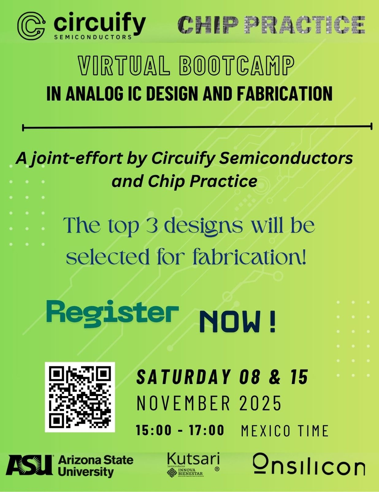
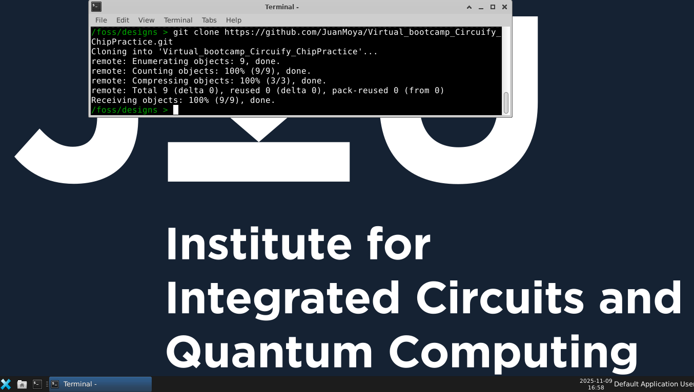
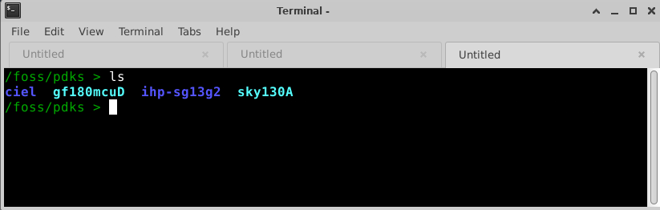
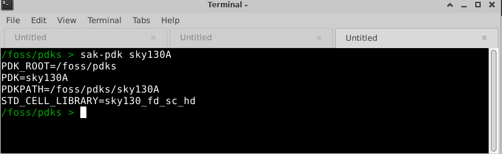

# Virtual Bootcamp Circuify ChipPractice

Este repositorio contiene información relacionada con la instalación de las herramientas open source y algunos laboratorios básicos para comprender algunos conceptos relacionados con el diseño de circuitos integrados con herramientas open source. Estos laboratorios corresponden a la primera sesión del bootcamp virtual organizado por Circuify, ChipPractice y la universidad de Arizona.

<p align="center">
   
</p> 

## Instalación de las herramientas.
Para descargar las herramientas, seguir el tutorial desarrollado por Jorge Iván Marín que se mencionan en el video del siguiente [link](https://www.youtube.com/watch?v=-l_SrxKEHt0).

Una vez instaladas las herramientas, clonar este repositorio dentro de la imagen del contenedor como se muestra en la siguiente imagen.

```
git clone https://github.com/JuanMoya/Virtual_bootcamp_Circuify_ChipPractice.git
```

<p align="center">
   
</p> 

Es importante mencionar que en el contenedor se encuentran los 3 PDKs open source (SKY130A, gf180mcuD e ihp-sg13g2), como se indica en la figura de abajo.

<p align="center">
   
</p> 

Por default, el PDK que está cargado es el de ihp-sg13g2, así que para cargar las variables de entorno asociadas al PDK de sky130A (es el PDK con el que se va a trabajar en este bootcamp), se debe correr el siguiente comando:

```
sak-pdk sky130A
```
<p align="center">
   
</p> 

Regresamos a la carpeta del bootcamp para iniciar con los Laboratorios (importante mencionar que el comando que se acabó de presentar se puede correr desde cualquier parte del contenedor ).
